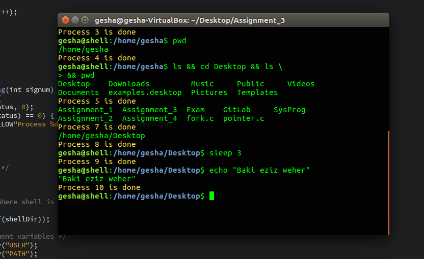

# SimpleShell
This shell is a simplified version of /bin/sh (without pipes, forwarding, ect.).
  

 
## How to use
- Run Makefile:
<pre>make</pre>
- Run the shell like this:
<pre>./shell</pre>
- That's it! Now simply enter your commands and the shell will execute them until you print "exit".
## Features
- Shell can execute several commands separated by the && characters.
- Shell allows to extend the input to the next line (put backslash "\\" character at the end of a line).
- Shell can execute new commands, while the old ones still run in the background.

<b>Credits to Malcolm X and linux.die.net</b>
